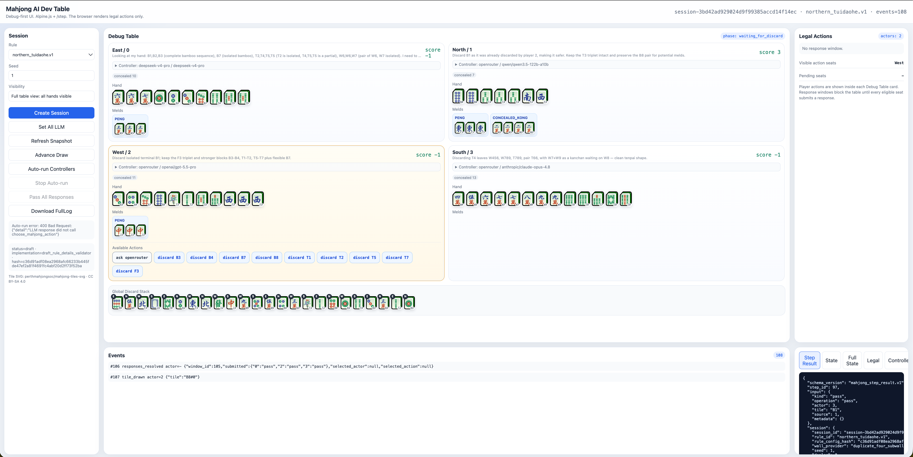

# Mahjong Web Table


Standalone Mahjong rules engine, browser debug table, and LLM controller playground.

[中文说明](./README.zh-CN.md)



## What This Project Includes

- A deterministic four-seat Mahjong table engine.
- A Northern Tuidaohe rule plugin for local table play.
- A browser-based debug table with full table visibility.
- Human, random, debug, and LLM-controlled seats.
- OpenAI-compatible LLM adapter presets for OpenAI, OpenRouter, DeepSeek, Gemini, Mistral, Groq, Together AI, xAI, and local OpenAI-compatible servers.
- Optional local `transformers` server for `Qwen/Qwen3.5-2B`.
- FullLog export for inspecting prompts, model decisions, table state, events, and scoring traces.

This standalone repository intentionally does not include MCR rules or the original training-data pipeline.

## Requirements

- Python 3.11 or newer
- A virtual environment, conda environment, or equivalent isolated Python runtime
- Optional: a GPU or Apple Silicon acceleration for local Qwen inference

## Install

```bash
python -m pip install -e .
```

For local Qwen inference:

```bash
python -m pip install -e '.[llm]'
```

## Run The Web Table

```bash
uvicorn mahjong_ai.web.app:app --host 127.0.0.1 --port 8765
```

Open:

```text
http://127.0.0.1:8765/
```

The UI shows all hands for debugging, legal actions, response windows, full state JSON, controller traces, and FullLog export.

## LLM Controller Presets

Each seat can be configured independently from the Debug Table player menu.

Built-in presets:

- `debug`: local deterministic controller for testing.
- `apple-fm`: Apple Foundation Models CLI through `fm`.
- `openai`: OpenAI Chat Completions API.
- `openrouter`: OpenRouter with `qwen/qwen3.5-flash-02-23` by default.
- `deepseek`: DeepSeek V4 Flash with thinking disabled.
- `deepseek-v4-pro`: DeepSeek V4 Pro with thinking disabled for tool calls.
- `gemini`: Google Gemini OpenAI-compatible endpoint.
- `mistral`: Mistral function calling endpoint.
- `groq`: Groq OpenAI-compatible endpoint.
- `together`: Together AI OpenAI-compatible endpoint.
- `xai`: xAI OpenAI-compatible endpoint.
- `local-openai`: local OpenAI-compatible endpoint, defaulting to `http://127.0.0.1:8001/v1`.

The adapter asks models to call the `choose_mahjong_action` tool with an `action_id` selected from the legal action list. Prompts include the current rule features, visible hand, public discards, exposed known tiles, recent public events, and legal actions.

Do not commit API keys. Enter provider tokens only in the local UI.

## Run A Local Qwen OpenAI-Compatible API

Model files are intentionally not tracked by Git. Download them into `models/`:

```bash
python -c 'from huggingface_hub import snapshot_download; snapshot_download(repo_id="Qwen/Qwen3.5-2B", local_dir="models/Qwen3.5-2B")'
```

Start the local OpenAI-compatible server:

```bash
python -u scripts/serve_qwen_transformers_openai.py \
  --model-path models/Qwen3.5-2B \
  --served-model-name qwen3.5-2b-transformers \
  --host 127.0.0.1 \
  --port 8001
```

The server exposes:

```text
GET  http://127.0.0.1:8001/v1/models
POST http://127.0.0.1:8001/v1/chat/completions
```

In the web UI, set an LLM player to:

```text
Provider: Local OpenAI-compatible
Base URL: http://127.0.0.1:8001/v1
Token: local
Model: qwen3.5-2b-transformers
```

## Run A Smoke Hand

```bash
python scripts/run_table_smoke.py --seed 42
```

## Test

```bash
python -m unittest discover -s tests
```

Expected result:

```text
OK
```

## Project Layout

```text
configs/rules/       Rule YAML configs
scripts/             Utility scripts and local model server
src/mahjong_ai/      Engine, rules, agents, observation, and web UI
tests/               Engine, rule, LLM adapter, and web API tests
logo.png             Project logo
test_1.png           Example UI screenshot
```

## Notes

- `models/`, `artifacts/`, build outputs, Python caches, and virtual environments are ignored by Git.
- The web table is a debug-first UI, not a hidden-information production client.
- The LLM controller only receives visible/player-legal information generated by the prompt builder.
- The UI intentionally exposes all hands to the human developer for testing.

